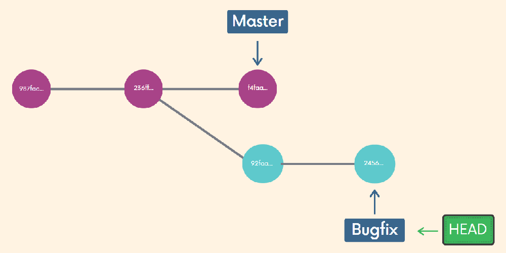
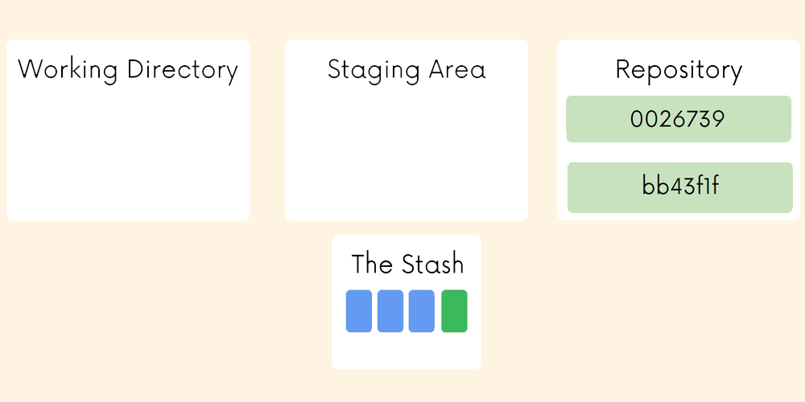
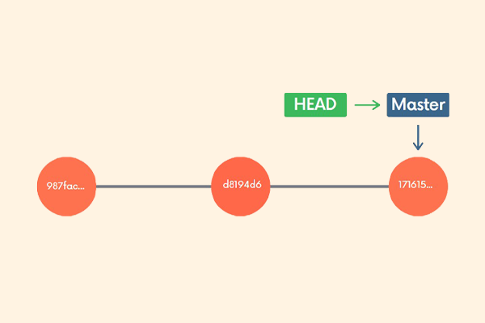
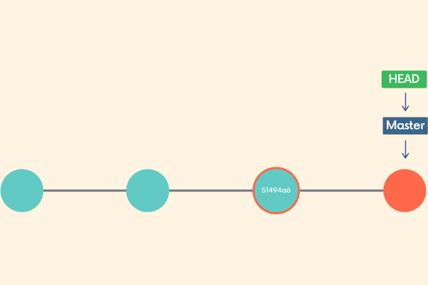

# Git & GitHub <!-- omit from toc -->


## Table of Contents <!-- omit from toc -->

- [1. Git Installation \& Terminal Commands](#1-git-installation--terminal-commands)
  - [1.1. Configuring Git](#11-configuring-git)
  - [1.2. Terminal Basic Commands](#12-terminal-basic-commands)
- [2. The Very Basics of Git](#2-the-very-basics-of-git)
  - [2.1. First git commands](#21-first-git-commands)
  - [2.2. Committing](#22-committing)
  - [2.3. Amending Commits](#23-amending-commits)
  - [2.4. Some Basic Guidelines](#24-some-basic-guidelines)
  - [2.5. Ignoring Files](#25-ignoring-files)
- [3. Branches](#3-branches)
  - [3.1. Working With Branches](#31-working-with-branches)
  - [3.2. Merging Branches](#32-merging-branches)
- [4. Comparing Changes](#4-comparing-changes)
  - [4.1. Comparisons with Git Diff](#41-comparisons-with-git-diff)
  - [4.2. Chunk Header](#42-chunk-header)
- [5. Stashing](#5-stashing)
  - [5.1. Git Stash](#51-git-stash)
  - [5.2. Applying Specific Stashes](#52-applying-specific-stashes)
  - [5.3. Clearing the Stash](#53-clearing-the-stash)
- [6. Undoing Changes](#6-undoing-changes)
  - [6.1. Checkout](#61-checkout)
  - [6.2. Restore](#62-restore)
  - [6.3. Git Reset](#63-git-reset)
  - [6.4. Git Revert](#64-git-revert)


<br>
<br>

****************

## 1. Git Installation & Terminal Commands

### 1.1. Configuring Git

If you are using a GUI, it should prompt you for your name and email the first time you open the app.

**Your name**
```bash
git config --global user.name "Tom Hulce"
```

**Your email**
```bash
git config --global user.email blah@blah.com
```

### 1.2. Terminal Basic Commands

| Command  | Name                    | Description                                                                                       |
| -------- | ----------------------- | ------------------------------------------------------------------------------------------------- |
| `ls`     | List                    | Use `/s` to list the contents of your current directory. Use `-a` after `ls` to show hidden files |
| `pwd`    | Print Working Directory | Prints the path to the working directory (where you currently are)                                |
| `cd`     | Change Directory        | Use `cd ..` to "back up" one directory                                                            |
| `touch`  | Touch                   | Use touch to create a file (or multiple)                                                          |
| `mkdir`  | Make Directory          | `mkdir` will create a new directory (or directories)                                              |
| `rm`     | rm                      | `rm` will delete a file or files. It permanently removes them                                     |
| `rm -rf` | rm -rf                  | Use this to delete a directory (r = recursive. f = force)                                         |


<br>
<br>

****************

## 2. The Very Basics of Git

### 2.1. First git commands

```bash
git status
```
Gives information on the current status of a git repository and its contents.

```bash
git init
```
Use this to create a new git repository. Before we can do anything git-related, we must initialize a repo first! 

DO NOT INIT A REPO INSIDE OF A REPO!: Before running `git init`, use `git status` to verify that you are not currently inside of a repo.

```bash
git log
```
Use this to see a log of previous commits and their hash values.

```bash
git log --oneline
```
`--oneline` is used to shorten the hash values and concise the log.


### 2.2. Committing

```bash
git add file1 file2

git add .
```
We use this command to stage changes to be committed. Use `git add` to add specific files to the staging area. Separate files with spaces to add multiple at once. Use `git add .` to stage all changes at once 


```bash
git commit
```
Running `git commit` will commit all staged changes. It also opens up a text editor and prompts you for a commit message.

```bash
git commit -m "my message"
```
The `-m` flag allows us to pass in an inline commit message, rather than launching a text editor.


### 2.3. Amending Commits

Suppose you just made a commit and then realized you forgot to include a file! Or, maybe you made a typo in the commit message that you want to correct.
Rather than making a brand new separate commit, you can "redo" the previous commit using the `--amend` option.

```bash
git commit -m "some commit"

git add forgotten_file

git commit --amend
```

### 2.4. Some Basic Guidelines

- Commit early and often

- Make commits atomic (group similar changes together, don't commit a million things at once)

- Write meaningful but concise commit messages


### 2.5. Ignoring Files

We can tell Git which files and directories to ignore in a given repository, using a `.gitignore` file. This is useful for files you know you NEVER want to commit, including:
- Secrets, API keys, credentials, etc.
- Operating System files (.DS_Store on Mac)
- Log files
- Dependencies & packages

Create a file called `.gitignore` in the root of a repository.

```bash
touch .gitignore
```

Inside the file, we can write patterns to tell Git which files & folders to ignore:

- `.DS_Store` will ignore files named .DS_Store
- `folderName/` will ignore an entire directory
- `*.log` will ignore any files with the .log extension


<br>
<br>

****************
## 3. Branches

### 3.1. Working With Branches

We'll often come across the term `HEAD` in Git.
`HEAD` is simply a pointer that refers to the current "location" in your repository. It points to a particular branch reference.


```bash
git branch
```
Use git branch to view your existing branches. The default branch in every git repo is master, though you can configure this. 
Look for the `*` which indicates the branch you are currently on.

**Note:** Remember, branches are made based on the `HEAD`.

Use the `-v` flag with git branch to view more information about each branch:
```bash
git branch -v
```

```bash
git branch "branch-name"
```
Use this to make a new branch based upon the current HEAD
This just creates the branch. It **does not** switch you to that branch (the HEAD stays the same)

Use the `-d` flag to delete a branch:
```bash
git branch -d "branch-name"
```

Once you have created a new branch, use git switch "branch-name" to switch to it.
```bash
git switch "branch-name"
```

When you make a new commit, it exists only on your new branch, not on master.

Use git switch with the `-c` flag to create a new branch and switch to it all in one go:
```bash
git switch -c "branch-name"
```

Historically, we used `git checkout "branch-name"` to switch branches. This still works.
```bash
git checkout "branch-name"
```
The `checkout` command does a million additional things, so the decision was made to add a standalone switch command which is much simpler.


### 3.2. Merging Branches

We merge branches, not specific commits

We always merge to the current `HEAD` branch

To merge, follow these basic steps:

1. `switch` to or `checkout` the branch you want to merge the changes into (the receiving branch)
```bash
git switch "current-branch-name"
```

2. Use the `git merge` command to merge changes from a specific branch into the current branch (To merge the "specific-branch-name" into "current-branch-name")
```bash
git merge "specific-branch-name"
```

> What if we add a commit on master?
> 
> This happens all the time! Imagine one of your teammates merged in a new feature or change to master while you were working on a branch
> 
> 


> What happens when I try to merge?
> 
> Rather than performing a simple fast forward, git performs a "merge commit" We end up with a new commit on the master branch. Git will prompt you for a message.
> 
> 
> 


**Whenever you encounter merge conflicts, follow these steps to resolve them:**
1. Open up the file(s) with merge conflicts
2. Edit the file(s) to remove the conflicts. Decide which branch's content you want to keep in each conflict.  Or keep the content from both.
3. Remove the conflict "markers" in the document:
The content from the branch you are trying to merge from is displayed between the `=======` and  `>>>>>>>` symbols.
4. Add your changes and then make a commit!


<br>
<br>

****************
## 4. Comparing Changes

### 4.1. Comparisons with Git Diff

We can use the `git diff` command to view changes between commits, branches, files, our working directory, and more!  

We often use `git diff` alongside commands like `git status` and `git log`, to get a better picture of a repository and how it has changed over time.

```bash
git diff
```
Without additional options, `git diff` lists all the changes in our working directory that are NOT staged for the next commit.


`git diff HEAD` lists all changes in the working tree since your last commit.
```bash
git diff HEAD
```

If you want to compare changes in different commits use `git diff <COMMIT1>..<COMMIT2>`

If you want to compare changes in different branches use `git diff <BRANCH_NAME1>..<BRANCH_NAME2>`

`git diff --staged` or `--cached` will list the changes between the staging area and our last commit. ("Show me what will be included in my commit if I run `git commit` right now")
	
	
### 4.2. Chunk Header

Each chunk starts with the chunk header, found between @@ and @@.

Example:

`@@ -3,4 +3,5 @@`

From file a, 4 lines are extracted starting from line 3. From file b, 5 lines are extracted starting from line 3.


<br>
<br>

****************
## 5. Stashing

Imagine you're on master branch and you make new branch and switch to it. You do some new work, but don't make any commits. When you switch back to master:
1. Your changes come with you to the destination branch
2. Git won't let you switch if it detects potential conflicts

Git provides an easy way of stashing these uncommitted changes so that we can return to them later, without having to make unnecessary commits.

### 5.1. Git Stash

`git stash` is super useful command that helps you save changes that you are not yet ready to commit. You can stash changes and then come back to them later.

Running `git stash` will take all uncommitted changes (staged and unstaged) and stash them, reverting the changes in your working copy.


```bash
git stash
```
**Note:** You can also use `git stash save` instead.



Use `git stash pop` to remove the most recently stashed changes in your stash and re-apply them to your working copy.

```bash
git stash pop
```

You can use `git stash apply` to apply whatever is stashed away, without removing it from the stash. This can be useful if you want to apply stashed changes to multiple branches.

```bash
git stash apply
```


If you have untracked files (files that you have never checked in to Git), they will not be included in the stash.

Fortunately, you can use the `-u` option to tell git stash to include those untracked files.

```bash
git stash -u
```

You can add multiple stashes onto the stack of stashes.  They will all be stashed in the order you added them.

```bash
git stash
# do some other stuff ...
git stash
# do some other stuff ...
git stash
```

**Note:** Run `git stash list` to view all stashes

```bash
git stash list

# stash@{0}: WIP on master: 049d078 Create index file
# stash@{1}: WIP on master: c264051 Revert "Add file_size"
# stash@{2}: WIP on master: 21d80a5 Add number to log
```

### 5.2. Applying Specific Stashes

Git assumes you want to apply the most recent stash when you run `git stash apply`, but you can also specify a particular stash like `git stash apply stash@{2}`

To delete a particular stash, you can use `git stash drop <stash-id>`

```bash
git stash drop stash@{2}
```

### 5.3. Clearing the Stash

To clear out all stashes, run `git stash clear`
```bash
git stash clear
```


<br>
<br>

****************
## 6. Undoing Changes

### 6.1. Checkout
We can use `git checkout` to create branches, switch to new branches, restore files, and undo history!

```bash
git checkout <commit-hash>
```
**Note:** You can use the `git log` command to view commit hashes. We just need the first 7 digits of a commit hash.

> **Example:**
>
> Suppose you want to go back to an old commit and make some new changes. With `git checkout <commit-hash>` you'll be in a detached HEAD state.
>
> 
>
> ```bash
> git checkout d8194d6
> ```
>
> 
> 
> While in detached HEAD, make a new branch and switch to it. Head is now back to pointing at a branch reference!
> 
> ```bash
> git switch -c newbranch
> ```
> 
> 
>
> Now on the new branch, make as many new commits as you want.
>
> ```bash
> git add .
> git commit -m "new commit"
> ````
>
> 

To reference previous commits using `git checkout` use the syntax below:

```bash
git checkout HEAD~1 # refers to the commit before HEAD (parent)
git checkout HEAD~2 # refers to 2 commit before HEAD (grandparent)
```

To discard any changes in that file, reverting back to the HEAD, you can use:
```bash
git checkout HEAD <filename>
```

There's another shorter option to revert a file:
```bash
git checkout -- <file>
```

Rather than typing HEAD, you can substitute `--` followed by the file(s) you want to restore.


### 6.2. Restore
`git restore` is a brand new Git command that helps with undoing operations.   

Suppose you've made some changes to a file since your last commit. You've saved the file but then realize you definitely do NOT want those changes anymore!
To restore the file to the contents in the HEAD: 
```bash
git restore <file-name>
```

**Note:** The above command is not "undoable". If you have uncommited changes in the file, they will be lost!

`git restore <file-name>` restores using HEAD as the default source, but we can change that using the `--source` option.

For example, `git restore --source HEAD~1 home.html` will restore the contents of home.html to its state from the commit prior to HEAD.  You can also use a particular commit hash as the source.

If you have accidentally added a file to your staging area with `git add` and you don't wish to include it in the next commit, you can use `git restore` to remove it from staging.

```bash
git restore --staged <file-name>
```

### 6.3. Git Reset
Suppose you've just made a couple of commits on the master branch, but you actually meant to make them on a separate branch instead.  To undo those commits, you can use git reset.
```bash
git reset <commit-hash>
```

`git reset <commit-hash>` will reset the repo back to a specific commit.  The commits are gone.


### 6.4. Git Revert
`git revert` is similar to `git reset` in that they both "undo" changes, but they accomplish it in different ways.

`git reset` actually moves the branch pointer backwards, eliminating commits.

`git revert` instead creates a brand new commit which reverses/undos the changes from a commit. Because it results in a new commit, you will be prompted to enter a commit message.
```bash
git revert <commit-hash>
```
**Note:** If you want to reverse some commits that other people already have on their machines, you should use `git revert`. If you want to reverse commits that you haven't shared with others, use `git reset` and no one will ever know!


```bash
git reset HEAD~2
```


The branch pointer is moved back to an earlier commit, erasing the 2 later commits.


```bash
git revert 51494a6
```



This new commit reverses the changes from 51494a6.